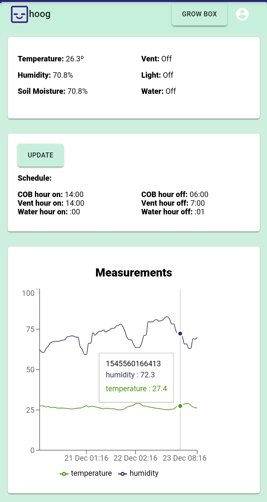
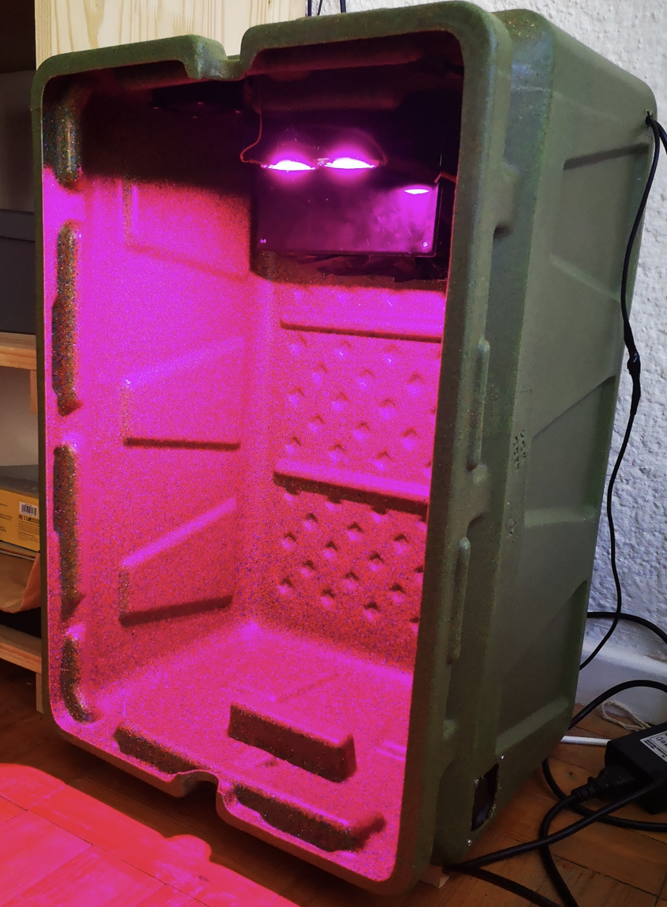

  
  

Hoog is a remote grow box that consists of three parts, an internet connected box with a plant inside, an IoT cloud management server and a web app to view and control the box. The box applicationn is for growing food indoors and to be made availible to people to monitor the status of the plants inside the box. 

The box itself consits of a raspberry pi device, electronic sensors ( temperature, humidity, soil moisture, airflow, fans, COB lights and a camera), which can all be controlled through API calls to the server running on the Raspberry Pi. 

The IoT management server is set up on Balena.io and is used to create a cluster of devices to the network. The server generates an unique ID that exposes the API endpoints on the individual devices. 

The React app is an interface that is used to connect to the box and IoT servers. The app collects data from the boxes and stores the data inside a firebase Database, and recalls it on a graph to show sennsor data over time. The light and watering schedule of the boxes can also be set on the app which takes care of the plant depending on the various types of plants.

Source: <a href="https://github.com/Stephan-e/hoog_server"><i class="large github icon"></i>Hoog</a>

