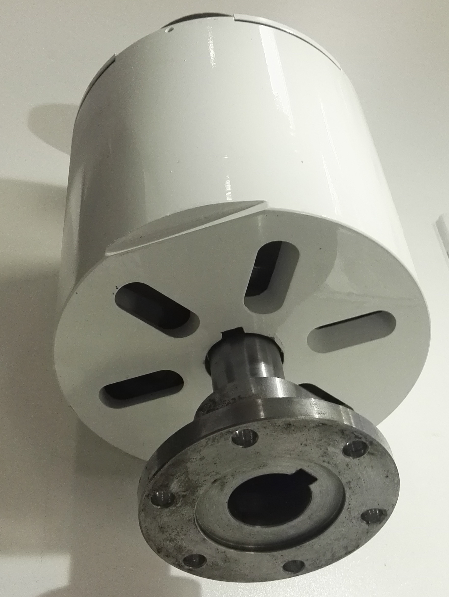
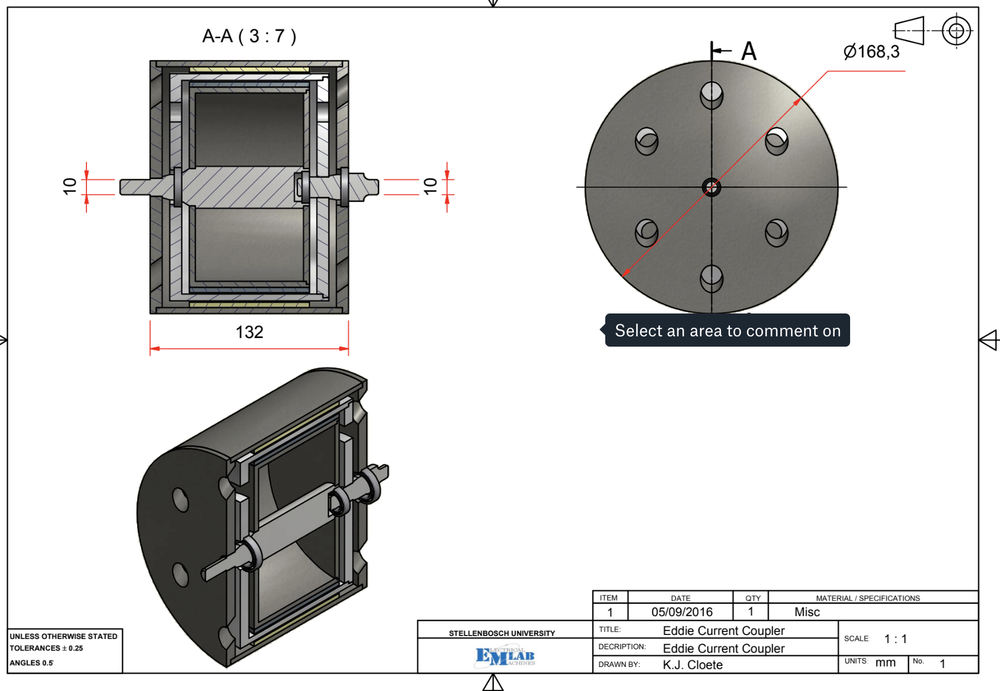

  
  

This formed part of my master's project and I had a lot of success in doing this project at Stellenbosch University under supervision of Prof. MJ Kamper. 

In doing a lot of research into wind turbines and mechanical enginering, as an electrical engineer I designed a machine that removes high frequency vibrations that occur on the shaft or rotor of a wind turbine. In doing so, it prolonges the life span of the generator and gearrbox in the system, resultng in overall savings and efficiency. 

The couplings were designed and evaluated using mathematical multi objective models and were programmed into python to excecute. The models then produced a pareto curve that was then analysed and impacted design choices. The design was then evaluated by building a physical model in a laboratory test set up. 

This product also gained some traction and seed funding to develop it.