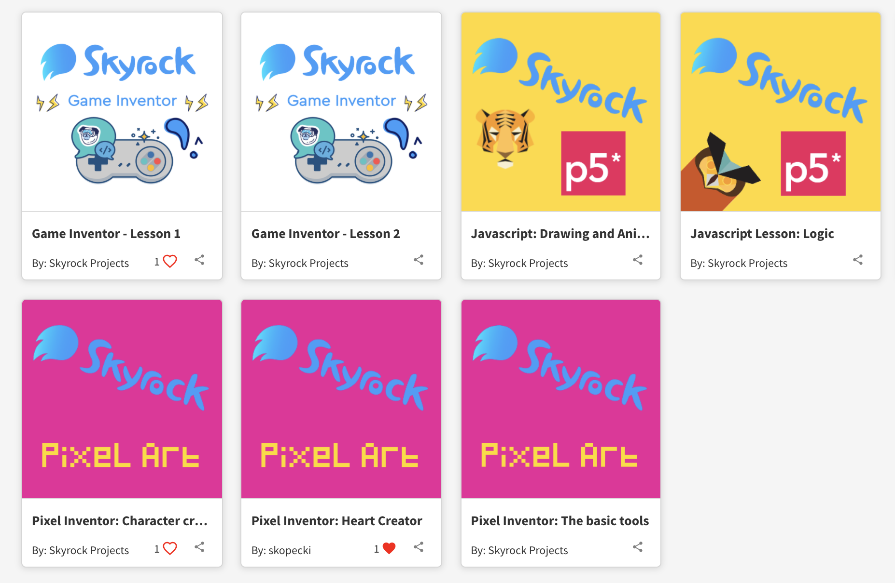

I spent time developing various parts of coding curriculum for students at Skyrock projects, most of the projects were either Javascript, Python or Block Coding, while also doing planning and structuring of all the tech curriculum in the School.

I also set up some open source rebranded sites hosted on google cloud for Skyrock students to access: [Skyrock Blockly](https://blockly.skyrockprojects.com/), [Skyrock Pixel Art](https://pixel.skyrockprojects.com/), [P5](https://skyrockjs.herokuapp.com/)

The startup did spend a lot of time trying to find a product market fit, so we experimented with a lot of different technologies and I have built over 20 lessons from a range of thechnologies, drone coding, game design, art, coding, etc. 

You can see some of the lessons here [Lessons on Workbench](https://edu.workbencheducation.com/partners/skyrockprojects).

